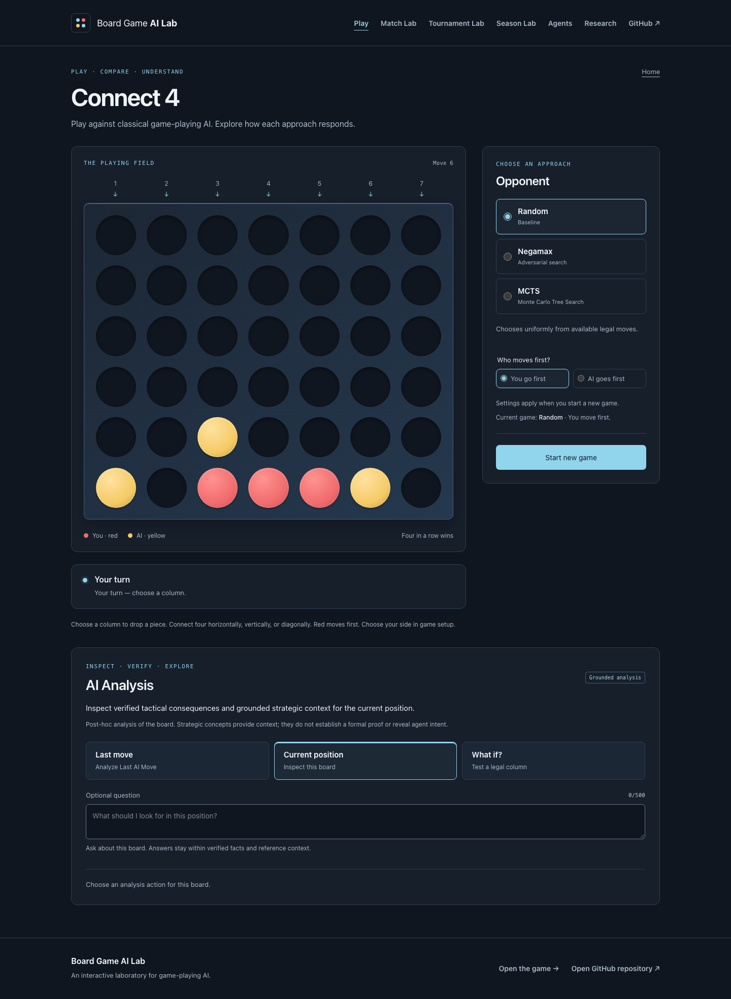
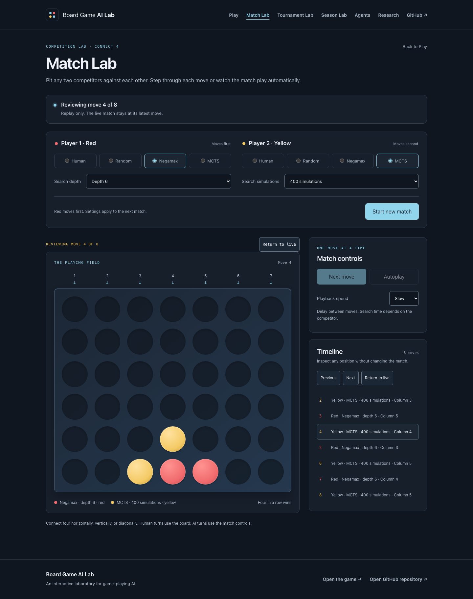

# Board Game AI Lab

An interactive **Connect 4 AI evaluation lab** for playing, comparing, explaining, and benchmarking game-playing agents. It combines deterministic Negamax, stochastic Monte Carlo Tree Search (MCTS), grounded post-hoc LLM analysis, and reproducible competition with verifiable evidence.

The engineering problem: keep gameplay, recovery, replay, and evaluation consistent across an asynchronous web application. The empirical result: all four Negamax depths finished above all MCTS variants in a verified, balanced **112-game benchmark**.

**[Open the live application](https://board-game-ai-lab-ui.onrender.com/)** · [Play](https://board-game-ai-lab-ui.onrender.com/connect4) · [Match Lab](https://board-game-ai-lab-ui.onrender.com/connect4/match-lab) · [Tournament Lab](https://board-game-ai-lab-ui.onrender.com/connect4/tournament) · [Season Lab](https://board-game-ai-lab-ui.onrender.com/connect4/season)

## What it demonstrates

- Classical adversarial search and bounded stochastic search behind one game/API contract.
- Reliable web orchestration: revision checks, sequential mutations, uncertain-response reconciliation, and compact local replay.
- Reproducible experiment design: seeded schedules, exact color balance, relative ratings, descriptive bootstrap intervals, and replayable exports.
- LLM grounding: explanations tied to verified board facts and references.

## Explore the lab

| Interface | What a visitor can do |
| --- | --- |
| **Play** | Choose an agent and who moves first, play a game, and inspect grounded analysis. |
| **Match Lab** | Configure both competitors, step or autoplay, and review the timeline. Supports Human/Human, Human/AI, and AI/AI. |
| **Tournament Lab** | Build a single-elimination bracket, watch AI matches, or enter as a human competitor. |
| **Season Lab** | Run balanced AI round robins; inspect standings, ratings, color splits, pairwise results, and exports. |

<details>
<summary>Application screenshots: Play and Match Lab replay</summary>





Real local application captures; [capture context](docs/assets/README.md). These are interface examples, not canonical benchmark results.

</details>

## Canonical benchmark

**`canonical-season-v1`: 8 agents, 112 completed games, seed `20261008`.** Each of the 28 pairs plays four games from the standard empty board, twice as Red and twice as Yellow. Every entrant plays 28 games with exact 14/14 color balance. The backend source is frozen at `c7d0ce65e0a2a23dc6f398164429bd1f2162228f`, captured in all 112 game manifests.

| Agent | W–D–L | Observed score rate | Final Elo |
| --- | ---: | ---: | ---: |
| Negamax depth 6 | 17–6–5 | 71.4% | 1586 |
| Negamax depth 8 | 18–4–6 | 71.4% | 1593 |
| Negamax depth 4 | 18–2–8 | 67.9% | 1575 |
| Negamax depth 2 | 18–0–10 | 64.3% | 1564 |
| MCTS 400 | 15–0–13 | 53.6% | 1531 |
| MCTS 800 | 13–0–15 | 46.4% | 1471 |
| MCTS 100 | 7–0–21 | 25.0% | 1395 |
| Random | 0–0–28 | 0.0% | 1285 |

Score rate is `(wins + 0.5 × draws) / games`; Elo is rounded here.

- **Negamax was the strongest family in this field.** Depths 6 and 8 tied on score rate and drew all four direct games. Depth 6 leads standings under the slot-seed tiebreak; depth 8 has the highest final Elo. Increasing depth did not produce a simple monotonic improvement.
- Increasing MCTS from 100 to 400 simulations substantially improved observed performance, while 800 simulations did not improve results further in this benchmark. MCTS 400 and 800 split their direct matchup 2–2; this does not establish intrinsic superiority of 400.
- Red won 59 games, Yellow 47, with 6 draws: **55.4% Red score rate**. This supports enforcing exact color balance; it does not precisely estimate a universal Connect 4 first-player advantage.

**Sampling limitation:** this is a reproducible balanced evaluation from the standard starting position, **not 112 independent statistical trials**. Deterministic Negamax opponents repeat the same trajectory for the same color assignment. Four games per pair are modest; Elo is relative to this pool and completion order. Deterministic bootstrap intervals describe **observed score rate**, not Elo uncertainty or formal agent strength.

The run took **293.6 seconds** on a local Apple M5 host. [Full results, intervals, pairwise findings, and runtime context](benchmarks/connect4/results/canonical-season-v1/README.md) · [evaluation JSON](benchmarks/connect4/results/canonical-season-v1/evaluation.json) · [games CSV](benchmarks/connect4/results/canonical-season-v1/games.csv) · [summary CSV](benchmarks/connect4/results/canonical-season-v1/summary.csv) · [run metadata](benchmarks/connect4/results/canonical-season-v1/run-metadata.json).

## System architecture

```mermaid
flowchart TD
    UI[React / Vite browser UI] --> Labs[Play / Match / Tournament / Season]
    Labs --> API[Flask / Gunicorn one-ply API]
    API --> Session[Bounded game sessions / revision lock]
    Session --> Agents[Random / Negamax / bounded UCT MCTS]
    Agents --> Evidence[Immutable move evidence]
    Evidence --> Replay[Browser compact replay / validated persistence]
    Evidence --> Grounding[Verified board facts / curated references]
    Grounding --> LLM[Grounded post-hoc LLM analysis]
    Replay --> Evaluation[Seeded schedule / Elo / bootstrap]
    Evaluation --> Export[JSON / CSV export / SHA-256 verifier]
```



The browser owns scheduling and local replay/evaluation state. The API commits one legal ply at an exact revision under a per-game lock and records immutable history. Tournaments and seasons retain **one live server game**, replacing it between fixtures and keeping completed replay locally.

Bounded in-memory sessions and one active MCTS search semaphore require one Gunicorn worker and one API instance. Docker Compose serves the UI through Nginx with a `/v1` proxy; Render hosts the static UI and containerized API separately with an exact CORS allowlist. [Deployment](docs/deployment.md) · [API health](https://board-game-ai-lab.onrender.com/v1/connect4/health) · [provenance endpoint](https://board-game-ai-lab.onrender.com/v1/connect4/provenance).

## Agents

| Public agent | Implementation |
| --- | --- |
| **Random** | Uniform choice among legal columns; a baseline with no lookahead. |
| **Negamax** | Depth-limited adversarial search, terminal dominance, zero draws, deterministic center-first ordering, and corrected transposition-table bound semantics. Public depths reach 8; depth 8 is not optimal Connect 4. |
| **MCTS** | UCT, stochastic rollouts, alternating-player rewards, and final visit-count selection, with immediate-win and immediate-loss-avoidance root guards. Public UI budgets: 100/400/800 simulations; these do not establish theoretical convergence. |

Random and MCTS use seeded local RNGs in competitions. Public agents need neither PyTorch nor neural checkpoints. **Experimental research**—DQN, neural MCTS, AlphaZero-style self-play, VictorAgent, and historical Mancala work—is separate from the public API and benchmark. Frozen AlphaZero campaign artifacts remain research records.

The [functional Victor research solver](docs/victor-functional-solver.md) adds bounded exact endgame solving, executable conditional nine-rule Black responses, restricted White threat contexts and complete CLI games. It labels exact results, established bounds and exploratory moves separately; it does not claim perfect play or change the public VictorAgent.

[Victor benchmarking and integration](docs/victor-performance-and-integration.md) evaluates it against an independent C oracle on 371 decisive positions and 1,120 adjudicated games. Exact search now reaches 24 empty cells; optimal-move accuracy rose from 70.4% to 79.0% and the game score from 0.790 to 0.844. Ablations show that exact search, CL/BI/VE and the composite rules each add measurable strength. An opt-in `victor_research` API agent (experimental, not perfect play) exists behind `VICTOR_RESEARCH_ENABLED`, which is **off by default** and not deployed.

```sh
.venv/bin/python -m games.connect4.victor.cli --white victor --black negamax:4
.venv/bin/python -m games.connect4.victor.cli --white human --black victor
```

## Reproducibility & evaluation

Season/game/per-ply seeds and implementation versions make experiments inspectable. Standings use points (win/draw/loss = 1/0.5/0), then score rate and slot seed. Elo starts at 1500, K=24. Deterministic bootstrap intervals use 1,000 resamples of each entrant's observed score vector; IID resampling does not account for deterministic repetitions or opponent dependence.

The verifier reconstructs schedules, checks exact color balance, legally replays games, checks provenance, and recomputes analytics and the evidence hash:

```sh
node ui/scripts/verify-evaluation-export.mjs \
  benchmarks/connect4/results/canonical-season-v1/evaluation.json
```

Expected: **Verification PASS, 112/112 games**, evidence SHA-256:

```text
e5845905b29c158cebed8579cd0a858b3a873a289d2b2e754c29601b7c9e407d
```

This evidence digest is not a whole-file hash or signature. It covers provenance, methodology, and evidence; export timestamp, derived analytics, and runtime metadata are excluded. The CLI generator commit is null; every game manifest and run metadata name the frozen backend source. Declarations and legal replay do not authenticate agent execution. [Provenance contract](docs/evaluation-provenance.md) · [methodology](benchmarks/connect4/canonical-season-v1.md).

## Grounded AI analysis

The LLM does not control gameplay. It produces post-hoc explanations from verified board state, legal moves, immutable move records, and curated strategic references. Visitors can analyze a recorded move, the current position, or a legal hypothetical move.

The system does not expose or invent hidden chain of thought, MCTS traces, UCB values, or agent intent. Tactical evidence is distinct from strategic references; formal Allis rule proofs are not implemented. Credentials stay server-side, with bounded requests, timeouts, concurrency, and caching. [Grounding design](docs/allis-grounding.md) · [explanation configuration](docs/llm-explanations.md).

## Engineering highlights

- **Mutation recovery:** no blind POST retry; reconcile with authoritative GET before explicit continuation.
- **Resource bounds:** 128 sessions, 30-minute idle expiry, one MCTS search per process, one live competition game.
- **Reproducible randomness:** local seeded RNGs preserve global randomness; schedules record colors, seeds, and completion order.
- **Portable evidence:** compact moves reconstruct boards, persistence is validated, and exports carry versioned provenance and SHA-256 evidence.
- **Browser verification:** replay, accessibility, responsive layout, stale responses, persistence, and downloads across three engines.

## Run locally

With Docker running, from the repository root:

```sh
docker compose up --build
```

Open **http://localhost:3000**. Gameplay needs no API key or `.env`. Stop with `Ctrl+C`, then `docker compose down`.

For development, use Python **3.11** and Node **22.12+**:

```sh
python3.11 -m venv .venv
source .venv/bin/activate
pip install -r requirements-dev.txt
EXPLANATIONS_ENABLED=false OPENAI_API_KEY='' \
  gunicorn api.app:app --bind 127.0.0.1:8000 --workers 1 --threads 4
```

In another terminal:

```sh
cd ui
npm ci
npm run dev
```

Open the Vite URL. Optional explanations need backend configuration; see [quickstart](docs/quickstart.md) and [provider settings](docs/llm-explanations.md).

## Tests / verification

```sh
EXPLANATIONS_ENABLED=false OPENAI_API_KEY='' .venv/bin/python -m pytest tests -q
cd ui
npm test
npm run build
VITE_API_BASE=https://board-game-ai-lab.onrender.com npm run build:render
```

Packaging verification: **501 backend passed**, with 14 existing optional PyTorch skips; **398 frontend passed**; **122 Chromium**, **33 Firefox**, **33 WebKit** passed. The final export smoke covers 12 executions across three browsers. Automated provider responses are mocked. [Verification record and local browser commands](docs/final-portfolio-packaging.md).

## Repository guide / deeper docs

| Path | Purpose |
| --- | --- |
| `games/connect4/`, `games/connect4/agents/` | Game rules, search agents, grounding |
| `api/` | Sessions, one-ply API, evidence, explanations |
| `ui/src/` | Interfaces, controllers, replay, competitions, analytics, exports |
| `benchmarks/connect4/results/canonical-season-v1/` | Canonical evidence and report |
| `tests/`, `ui/tests/`, `ui/e2e/` | Backend, frontend, browser checks |
| `docs/`, `project_plan.md` | Deployment, technical reports, research history |

**Development history / technical reports:** [Match](docs/phase5a-match-lab.md), [Tournament](docs/phase5b-tournament-lab.md), [human participation](docs/phase5c-human-tournament-participation.md), [Season analytics](docs/phase5d-season-ratings-lab.md), [exports](docs/phase5e-evaluation-provenance-export.md), [search corrections](docs/public-agent-strength-and-turn-order.md), and [project/research history](project_plan.md).

## Limitations / research status

The public Connect 4 and competition/evaluation system is feature-complete. Sessions and limits are process-local: restarts lose live games, horizontal scaling is unsupported, and simulation budgets are not deadlines. Replay persistence is browser-local. Canonical timing is machine-specific; the benchmark neither solves Connect 4 nor establishes definitive rankings.

AlphaZero and other learned-agent work remains experimental and separate. Broader opening coverage and independent repetitions could address future research questions, outside this completed scope. Check public deployment freshness separately when releasing these packaging changes.
